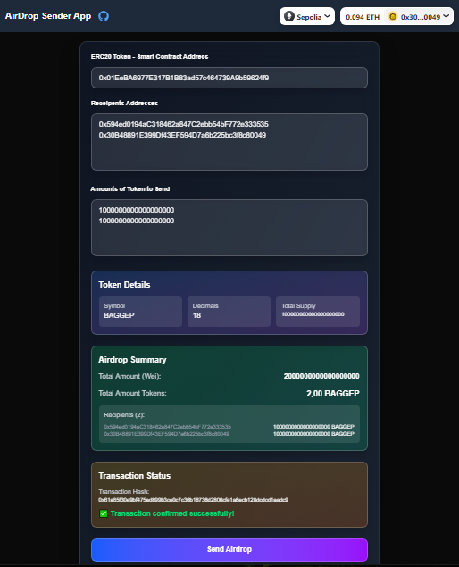

# Web3 Airdrop Sender App

A comprehensive decentralized application (dApp) built with Next.js for efficiently distributing ERC20 tokens to multiple recipients through automated airdrops. This application provides a user-friendly interface for managing token distributions across multiple blockchain networks.

## 🚀 Features

### Core Functionality
- **Multi-Chain Support**: Deployed on Optimism, Arbitrum, Base, zkSync, Sepolia, and Anvil (local development)
- **ERC20 Token Airdrops**: Send tokens to multiple recipients in a single transaction
- **Smart Contract Integration**: Uses deployed airdrop contracts for gas-efficient distributions
- **Wallet Connection**: Seamless integration with MetaMask and other Web3 wallets via RainbowKit
- **Real-time Token Details**: Automatically fetches token symbol, decimals, and total supply

### User Experience
- **Form Persistence**: Inputs are automatically saved to localStorage to prevent data loss on refresh
- **Input Validation**: Handles comma-separated or newline-separated addresses and amounts
- **Real-time Calculations**: Automatic total amount calculation with proper formatting
- **Transaction Status**: Live transaction tracking with confirmation status and error handling
- **Responsive Design**: Modern UI with Tailwind CSS and glassmorphism effects

### Advanced Features
- **Token Approval Management**: Automatically handles ERC20 token approvals before airdrops
- **Detailed Summary**: Shows recipient list with individual amounts and total distribution
- **Loading States**: Visual feedback during transaction processing with spinners
- **Error Handling**: Comprehensive error messages for failed transactions
- **Unit Testing**: Full test coverage for calculation functions using Vitest
- **End-to-End Testing**: Automated testing with Playwright and Synpress for wallet interactions

## 🛠️ Technical Stack

### Frontend
- **Framework**: Next.js 16.0.1 with React 19.2.0
- **Styling**: Tailwind CSS 4 with custom glassmorphism effects
- **Web3 Integration**: 
  - Wagmi 2.19.2 for blockchain interactions
  - RainbowKit 2.2.9 for wallet connection
  - Viem 2.38.6 for Ethereum library
  - React Query 5.90.7 for state management

### Testing
- **Unit Tests**: Vitest with comprehensive test coverage
- **E2E Tests**: Playwright with Synpress for MetaMask integration
- **Test Networks**: Support for Sepolia testnet and Anvil local development

### Smart Contracts
- **Airdrop Contract**: Custom Foundry-based airdrop sender contract
- **ERC20 Support**: Full compatibility with standard ERC20 tokens
- **Multi-Network Deployment**: Contracts deployed across multiple EVM chains

## 📋 Supported Networks

The application supports the following blockchain networks:

| Network | Chain ID | Airdrop Contract Address |
|---------|----------|--------------------------|
| Optimism | 10 | `0xAaf523DF9455cC7B6ca5637D01624BC00a5e9fAa` |
| Arbitrum | 42161 | `0xA2b5aEDF7EEF6469AB9cBD99DE24a6881702Eb19` |
| Base | 8453 | `0x31801c3e09708549c1b2c9E1CFbF001399a1B9fa` |
| zkSync | 324 | `0x7e645Ea4386deb2E9e510D805461aA12db83fb5E` |
| Sepolia Testnet | 11155111 | `0x08caA548a302C465e28432449C9De03ea091Af48` |
| Anvil (Local) | 31337 | `0x5FbDB2315678afecb367f032d93F642f64180aa3` |

## Screenshot


## 🚀 Getting Started

### Prerequisites
- Node.js (version 18 or higher)
- MetaMask or compatible Web3 wallet
- Access to one of the supported blockchain networks

### Installation

1. **Clone the repository**
   ```bash
   git clone <repository-url>
   cd web3-airdrop-sender-app
   ```

2. **Install dependencies**
   ```bash
   npm install
   ```

3. **Set up environment variables**
   Create a `.env.local` file in the root directory:
   ```env
   NEXT_PUBLIC_WALLET_CONNECT_PROJECT_ID=your_walletconnect_project_id
   ```

4. **Run the development server**
   ```bash
   npm run dev
   ```

5. **Open the application**
   Navigate to [http://localhost:3000](http://localhost:3000) in your browser

### Local Development with Anvil

For local development and testing:

```bash
# Start local Anvil blockchain
npm run anvil

# In a separate terminal, run the development server
npm run dev
```

## 🧪 Testing

### Unit Tests
```bash
npm run test:unit
```

### End-to-End Tests
```bash
# Initialize Playwright
npx playwright install
```

### Synpress Setup (for MetaMask testing)
```bash
# Download MetaMask plugin for testing
npx synpress --force
```
### Run E2E tests
```bash
npx playwright test

### Run E2E tests with UI
npx playwright test --ui
```

## 📝 Usage Guide

### 1. Connect Your Wallet
- Click the "Connect Wallet" button in the header
- Select your preferred wallet provider (MetaMask recommended)
- Approve the connection request

### 2. Enter Token Details
- **ERC20 Token Address**: Provide the contract address of the token you want to distribute
- The application will automatically fetch token details (symbol, decimals, total supply)

### 3. Add Recipients
- **Recipient Addresses**: Enter wallet addresses separated by commas or newlines
- **Amounts**: Enter corresponding token amounts for each recipient
- Format: `address1, address2, address3` and `amount1, amount2, amount3`

### 4. Review Summary
- Check the airdrop summary showing total amount and individual distributions
- Verify all addresses and amounts are correct

### 5. Send Airdrop
- Click "Send Airdrop" to initiate the transaction
- Approve token spending if required (first time for each token)
- Confirm the airdrop transaction in your wallet
- Monitor transaction status in real-time

## 🔧 Configuration

### Custom Networks
The application supports custom network configurations through the `chainsToTSender` mapping in `src/constants.ts`. To add a new network:

```typescript
const chainsToTSender: ContractsConfig = {
  [chainId]: {
    tsender: "your_airdrop_contract_address",
    no_check: "optional_no_check_address"
  }
}
```

### Styling Customization
Styles are managed in `src/components/AirdropForm.styles.ts` using Tailwind CSS classes. The application features:
- Glassmorphism effects with backdrop blur
- Gradient backgrounds
- Responsive grid layouts
- Smooth animations and transitions

## 🏗️ Project Structure

```
src/
├── app/                    # Next.js app router pages
│   ├── layout.tsx         # Root layout with providers
│   ├── page.tsx           # Home page
│   └── globals.css        # Global styles
├── components/            # React components
│   ├── AirdropForm.tsx    # Main airdrop form
│   ├── Header.tsx         # App header with wallet connection
│   ├── Footer.tsx         # App footer
│   └── ui/                # Reusable UI components
├── utils/                 # Utility functions
│   └── calculate/         # Calculation utilities
├── constants.ts           # Contract addresses and ABIs
└── rainbowKitConfig.tsx   # Wallet configuration
```

## 🔒 Security Features

- **Input Validation**: All addresses and amounts are validated before processing
- **Token Approval Checks**: Verifies sufficient token allowance before airdrops
- **Transaction Confirmation**: Requires multiple confirmations for security
- **Error Boundaries**: Graceful error handling for failed transactions
- **Local Storage Encryption**: Form data persistence with proper sanitization

## 🌐 Deployment

The application can be deployed to various platforms:

### Vercel (Recommended)
```bash
npm run build
# Deploy to Vercel through GitHub integration
```

### Fleek (Web3 Hosting)
```bash
# Deploy to IPFS via Fleek
# Configuration available at hosting.fleek.xyz
```

## 🤝 Contributing

1. Fork the repository
2. Create a feature branch: `git checkout -b feature/new-feature`
3. Commit your changes: `git commit -am 'Add new feature'`
4. Push to the branch: `git push origin feature/new-feature`
5. Submit a pull request

## 📄 License

This project is licensed under the MIT License - see the LICENSE file for details.

## 🔗 Related Projects

- **Airdrop Contract**: [Foundry Airdrop Sender](https://github.com/gaboegui/foundry-airdrop-sender)
- **Deployed Contract**: [Sepolia Etherscan](https://sepolia.etherscan.io/address/0x08caa548a302c465e28432449c9de03ea091af48#code)

## 📞 Support

For support and questions:
- Create an issue on GitHub
- Contact the developer via LinkedIn
- Check the deployed application for live demonstrations

## 👨‍💻 Developer

### Gabriel Eguiguren P.

[](https://x.com/GaBoEgui)
[](https://www.linkedin.com/in/gabrieleguiguren/)

## Donations

If you found this project helpful, feel free to follow me or make a donation!

**ETH/Arbitrum/Optimism/Polygon/BSC/etc Address:** `0x2210C9bD79D0619C5d455523b260cc231f1C2F0D`

---

**Note**: Always test with small amounts first and ensure you have sufficient gas fees for transactions. The application is designed for efficiency but blockchain transactions are irreversible.
